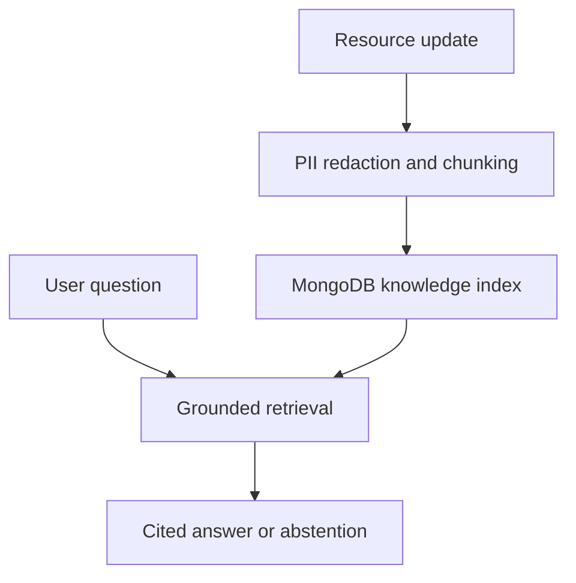

# CivicBridge AI

CivicBridge AI turns community-resource updates into a searchable, evidence-backed knowledge base. It redacts obvious contact data before indexing, retrieves relevant passages, returns source citations, and abstains when the available evidence is not strong enough.

## What the system does



The answer layer receives retrieved context instead of the entire document collection. Citations and confidence signals are returned separately so the frontend can display provenance and explain when the system cannot answer safely.

## AI and data design

- `HashingEmbedder` provides a deterministic offline baseline with no paid API dependency.
- MongoDB stores source documents and chunk embeddings when `MONGO_URI` is configured.
- SQLite is used as a local SQL fallback for development and tests.
- An optional hosted provider can be enabled with the `openai` package and `OPENAI_API_KEY`.
- The evaluation endpoint measures retrieval recall, citation coverage, and abstention behavior.
- The redaction stage removes common email and phone-number patterns before indexing.

## Technology

- Frontend: React, TypeScript, Vite
- API: Python, FastAPI, Pydantic, SQLAlchemy
- AI pipeline: retrieval, deterministic embeddings, optional hosted model integration
- Storage: MongoDB with SQLite fallback
- Operations: Docker Compose, GitHub Actions, Prometheus metrics

## Getting started

### Start the services

```bash
npm install
docker compose up --build
```

The API is available at `http://localhost:8002`. FastAPI documentation is available at `http://localhost:8002/docs`, and metrics are exposed at `http://localhost:8002/metrics`.

### Start the frontend

```bash
npm run dev
```

### Optional hosted AI provider

The default configuration runs with the offline embedder. To enable the optional hosted provider, install the provider package in the backend environment and set:

```bash
OPENAI_API_KEY=your-key
```

The key should be supplied through the runtime environment and should not be committed to the repository.

## API surface

| Method | Endpoint | Purpose |
| --- | --- | --- |
| `POST` | `/api/v1/documents` | Redact, chunk, and index a resource document |
| `GET` | `/api/v1/documents` | List indexed documents and chunk counts |
| `POST` | `/api/v1/ask` | Retrieve evidence and return a cited answer or abstention |
| `POST` | `/api/v1/evals/run` | Run the configured evaluation cases |
| `GET` | `/healthz` | Check SQL and MongoDB storage state |
| `GET` | `/metrics` | Export Prometheus metrics |

## Validation

```bash
pytest -q backend/tests
npm run build
npm run typecheck
```

The backend tests exercise document ingestion, redaction, retrieval, citations, and abstention behavior. The GitHub Actions workflow also runs a MongoDB round-trip integration test. With MongoDB running locally, execute it with:

```bash
MONGO_INTEGRATION=1 \
MONGO_URI=mongodb://localhost:27017 \
MONGO_DATABASE=civicbridge_test \
pytest -q backend/tests/test_mongo_integration.py
```

## Reproducible load measurement

The [GitHub Actions benchmark run](https://github.com/MarthalaJagruthiReddy/civicbridge-ai/actions/runs/34620845148) sent 300 grounded Q&A requests with 20 concurrent clients against a real MongoDB 8 service and the offline extractive model:

| Metric | Result |
| --- | ---: |
| Successful requests | 300 / 300 |
| Throughput | 639.33 requests/sec |
| Latency p50 / p95 / p99 | 30.14 / 35.30 / 37.88 ms |
| Errors | 0 |

These are measurements from that CI runner and workload, not production capacity guarantees. Re-run the benchmark workflow before comparing code changes.

## Repository layout

```text
backend/app/ai/    Retrieval, redaction, storage, service, and evaluation logic
backend/app/       FastAPI routes, persistence models, and metrics
frontend/          React knowledge-base interface
docker-compose.yml MongoDB and API services
```

## Next steps

- Move the vector search path to MongoDB Atlas Vector Search for larger indexes.
- Expand the reviewed evaluation set and add regression cases for stale resources.
- Add role-based document administration, document versioning, and larger retrieval benchmarks.
